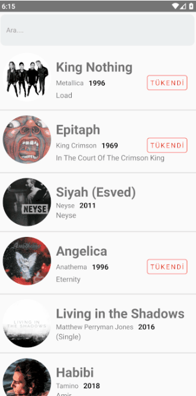

<h1 style="text-align:center">React Native MusicList App</h1>
<h6>Components use in App : FlatList,Image,TextInput,StyleSheet</h6>

<h6>Features of App :
<ul>
<li>User can see music list</li>
<li>User can see music list by search</li>
</ul>

